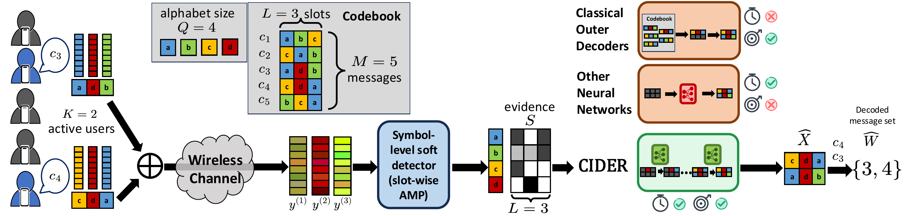

# CIDER

**Codeword Demixing with Error correction and Recurrent inference** — a diffusion-based decoder for multi-user random access over GF(*Q*) LDPC codes.

Code for **Structured Masked Diffusion for Joint Multiuser Decoding**<br>
Taekyun Lee<sup>*</sup>, Jiyoung Yun<sup>*</sup>, Jeffrey Andrews, Hyeji Kim<br>
<sup>*</sup>Equal contribution.<br>
arXiv: TBD

CIDER performs **joint error correction and multi-user demixing** of colliding codewords. Given soft per-position likelihoods from an inner channel decoder, it recovers the *K* active users' codewords via MaskGIT-style discrete masked diffusion with iterative confidence-based unmasking, plus a lightweight **PRISM** quality head for self-correction at higher user loads.

<p align="center">
  
</p>

## Problem setup

A random-access channel with *K* active users transmitting GF(*Q*) LDPC codewords that collide on a shared medium.

| Symbol | Shape | Meaning |
| --- | --- | --- |
| `Y` | `[B, N, Q]` | Soft likelihoods from the inner decoder (model input) |
| `X0` | `[B, K, N]` | Ground-truth *K* codewords in GF(*Q*) (target) |
| `H` | `[M, N]` | LDPC parity-check matrix |

`K` = active users/slots, `N` = code length, `Q` = field order, `M` = parity checks.

## Installation

```bash
conda env create -f requirements.yaml
conda activate muecc
```

## Data generation (GPU-batched)

Datasets are generated from a parity-check matrix `H` through an AWGN inner channel with a partial-DFT sensing matrix and a batched AMP inner decoder (all on GPU). Output tensors land in `~/data/demix/<Dataset>/` (override via `data_dir`).

```bash
# Step 1: construct H  →  H_matrix.pt
# Step 2: GPU-batched inner-channel simulation  →  train/val/test_data.pt
bash data/gen_data/ldpc_tiny.sh        # tiny (Q=64, N=12, K=2)
bash data/gen_data/ldpc_small.sh
bash data/gen_data/ldpc_moderate.sh
bash data/gen_data/ldpc_large.sh
# higher user loads for the protocol-scaling experiments:
bash data/gen_data/ldpc_tiny_k3.sh
bash data/gen_data/k4.sh
bash data/gen_data/k5.sh
```

Internals: `construct_H.py` (structured high-girth / Möbius-ladder codes) → `generate_data_from_H.py`, which uses `gf_gpu.py` (GPU GF(*Q*) arithmetic + LDPC encode), `noisy_channel/modulation_encoder.py` (sensing matrix), and `noisy_channel/modulation_decoder_batch.py` (the batched GPU AMP inner decoder).

## Training

Two stages.

**Stage 1 — diffusion backbone:**
```bash
./scripts/train_diffusion.sh tiny_ldpc tiny cider
# or: python main.py mode=train data=tiny_ldpc size=tiny model=cider
```

**Stage 2 — PRISM quality head** (lightweight self-correction head, trained on a frozen backbone):
```bash
./scripts/train_prism_head.sh tiny_ldpc tiny cider
```

**Baselines:**
```bash
./scripts/train_baseline.sh tiny_ldpc mlp
./scripts/train_baseline.sh tiny_ldpc transformer
```

## Evaluation

```bash
# CIDER — single dataset/size
./scripts/eval.sh tiny_ldpc tiny cider

# CIDER — protocol-level, multiple user loads K (PRISM dispatch for K>=6)
./scripts/eval_protocol.sh

# CIDER — PUPE vs Eb/N0 sweep on on-the-fly test data
./scripts/eval_snr_sweep.sh

# Rule-based baselines
./scripts/eval_rules.sh sic_bp tiny_ldpc
python inference/eval_rules.py top_j_es tiny_ldpc

# Tree-code (stitching decoder)
./scripts/eval_tree_code.sh
```

## Configuration (Hydra)

All config is composed with [Hydra](https://hydra.cc/); override any field on the CLI:

```bash
python main.py mode=train data=moderate_ldpc model=cider_gru optim.lr=5e-4 training.batch_size=256
```

| Group | Dir | Selects |
| --- | --- | --- |
| `data` | `configs/data/` | dataset (Q, N, K, M) |
| `size` | `configs/size/` | width / depth / inference steps |
| `model` | `configs/model/` | architecture |
| `training` | `configs/training/` | optimization |
| `adapter` | `configs/adapter/` | PRISM head |

## Model variants (glossary)

The model names encode an ablation/variant matrix. CIDER variants use closely related backbones in `models/` and differ in which modules are present and how inference is run.

| `model=` | Class | What it is |
| --- | --- | --- |
| `cider` | `CIDER` | **Main model.** Masked-diffusion backbone: Module A (slot responsibility, channel domain) + Module B (neural message passing, code domain), with iterative MaskGIT-style unmasking. |
| `cider_gru` | `CIDER_GRU` | CIDER with an added **GRU** that carries state across diffusion steps. |
| `cider_noA` | `CIDER_NoSlot` | **Ablation** — removes Module A (slot responsibility). |
| `cider_noB` | `CIDER_NoMP` | **Ablation** — removes Module B (message passing). |
| `cider_direct` | `CIDER_direct` | **One-shot** inference (no iterative unmasking), no GRU. |
| `cider_gru_direct` | `CIDER_GRU_direct` | One-shot inference variant with GRU. |
| `cider_iterative` | `CIDER_iterative` | Iterative refinement **without** MaskGIT masking. |
| `mdd` | `DiT` | DiT-style masked **discrete-diffusion baseline** (not a CIDER variant). |

**Learned (non-diffusion) baselines:** `mlp`, `cnn`, `transformer`, `gnn`, `nbp` (unfolded BP), `mpa` (one-shot message passing).

**Rule-based (classical) baselines** — run via `inference/eval_rules.py`:
- `sic_bp` — factorized successive-interference BP demixer.
- `top_j_es` — beam-search (top-*J*) decoder.
- `stitching` — SPARC-style stitching decoder (used for the tree-code experiment).

**PRISM head** (`models/prism_head.py`): a small token-quality MLP trained on the frozen backbone; at high user loads (K ≥ 6) it drives a confidence-based remasking pass during inference (`inference/eval_protocol.py`).

## Repository layout

```
main.py                 Entry point — modes: train | prism_head | eval | test
diffusion.py            PyTorch Lightning module (diffusion training/inference)
dataloader.py           Unified data interface (precomputed + on-the-fly)
models/                 CIDER backbone, variants, PRISM head, baselines
data/
  data.py               E2EDataset (loads precomputed Y, X0, H)
  data_onthefly.py      On-the-fly test generation (SNR sweeps)
  gen_data/             Code construction + GPU-batched channel simulation
inference/              Evaluation: protocol, per-K, SNR sweep, rule baselines
rules/                  Classical baselines (SIC-BP, top-J, stitching)
utils/                  GF(Q) arithmetic, Hungarian matching, checkpoint utils
configs/                Hydra config groups
scripts/                Training / evaluation shell wrappers
```

## Naming conventions

- **Datasets:** `{tiny,small,moderate,large}_ldpc`
- **Sizes:** `tiny` (128D), `small`, `moderate`, `large`
- **Diffusion checkpoints:** `checkpoints/{data}_{size}_{model}/best_model.ckpt`
- **Baseline checkpoints:** `checkpoints/{data}_{model}/best_model.ckpt`
- **Data paths:** `~/data/demix/tiny_LDPC/`, `~/data/demix/small_LDPC/`, `~/data/demix/moderate_LDPC/`, `~/data/demix/large_LDPC/`
